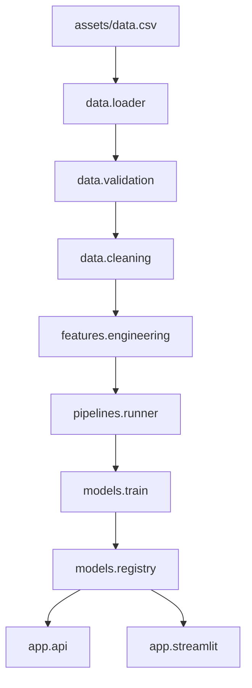

# Product Demand Forecasting

Production-grade weekly demand forecasting at `(store_id, sku_id)` granularity. Predicts SKU-level unit sales using lag features, price signals, and promotional flags with a leakage-safe chronological pipeline.

## Overview

End-to-end ML system for retail demand planning: validated data ingestion, versioned feature engineering, model registry, REST API, and Streamlit dashboard. Refactored from an exploratory notebook that demonstrated target leakage ([`extras/docs/archive/Forecast.ipynb`](extras/docs/archive/Forecast.ipynb), output-stripped archive).

## Problem Statement

Retailers need accurate per-SKU weekly forecasts to reduce stockouts and overstock. Aggregating all SKUs per store hides demand patterns; this project forecasts at store-SKU level with past-only features and chronological evaluation.

## Features

- Lag features (1–4 weeks) per time series
- v2 price/promo features: `total_price`, `base_price`, `is_featured_sku`, `is_display_sku`, `price_diff`
- Hydra-composed YAML configuration with CLI overrides
- Versioned model registry with retention policy
- FastAPI `/predict` endpoint for external integrations
- Streamlit UI for interactive exploration
- Pandera schema validation and no-leakage test suite

## Tech Stack

| Layer | Technology |
|-------|------------|
| Language | Python 3.11+ |
| ML | scikit-learn, XGBoost |
| Validation | Pandera, Pydantic |
| Config | Hydra, OmegaConf |
| API | FastAPI, Uvicorn |
| UI | Streamlit, Matplotlib |
| Tooling | pytest, ruff, mypy |

## Architecture



## Project Structure

```
demand-forecast/
├── app/                 # FastAPI + Streamlit applications
├── src/
│   ├── data/            # Load, validate, clean
│   ├── features/        # Feature engineering
│   ├── models/          # Train, predict, registry
│   ├── pipelines/       # Training/evaluation CLI
│   ├── config/          # Settings + Hydra loader
│   └── utils/           # Logging helpers
├── configs/             # Hydra YAML configuration
├── assets/data.csv      # Production dataset (gitignored)
├── infra/Dockerfile     # Container image
├── tests/               # Pytest suite
├── extras/notebooks/eda.ipynb  # Optional EDA
├── main.py              # Root CLI entry point
├── pyproject.toml
└── requirements.txt
```

## Installation

Requires Python 3.11+.

```bash
python -m venv .venv
.venv\Scripts\activate          # Windows
# source .venv/bin/activate     # macOS/Linux
pip install -e ".[dev]"
```

Place the dataset at `assets/data.csv` before training (not committed to git).

## Configuration

Main config: [`configs/config.yaml`](configs/config.yaml)

| Setting | Default | Description |
|---------|---------|-------------|
| `data.path` | `assets/data.csv` | Input CSV path |
| `data.granularity` | `store_sku` | `store_sku` or `store_only` |
| `split.test_size_pct` | `0.15` | Chronological holdout fraction |
| `model.type` | `random_forest` | `random_forest` or `xgboost` |
| `registry.keep_last_n` | `5` | Model versions to retain |

Feature config: [`configs/features/v2.yaml`](configs/features/v2.yaml)

Copy [`.env.example`](.env.example) to `.env` for optional Streamlit auth.

## Usage

```bash
# Train production model (bounded RF)
python main.py train

# Hyperparameter tuning
python main.py train --tune

# Evaluate a saved version
python main.py evaluate model_version=20260714_181954

# Regenerate model via script
bash scripts/download_models.sh
```

Legacy entry points still work: `python src/pipeline.py train`

## Training Pipeline

1. Load and validate CSV (Pandera schema)
2. Parse dates, impute missing prices
3. Build lag/price features per `(store_id, sku_id)` series
4. Chronological train/test split (no future leakage)
5. Train Random Forest (or XGBoost)
6. Evaluate MAE, RMSE, MAPE, R² on holdout
7. Save to `models/{version}/`

## Inference

Models load from `models/` via the registry. Latest version is used by default.

```bash
python scripts/verify_model_baseline.py
```

## API

```bash
uvicorn app.api.main:app --host 0.0.0.0 --port 8000
```

```bash
curl -X POST http://localhost:8000/predict \
  -H "Content-Type: application/json" \
  -H "X-API-Key: $API_KEY" \
  -d '{"features": {"lag_1": 10, "lag_2": 8, "lag_3": 6, "lag_4": 4, "total_price": 198.0, "base_price": 200.0, "is_featured_sku": 0, "is_display_sku": 0, "price_diff": -2.0}}'
```

When `API_KEY` is unset, authentication is disabled for local development. Set `API_KEY` in `.env` or the environment to require the `X-API-Key` header on `POST /predict`. `GET /health` remains open.

Endpoints: `GET /health`, `POST /predict`

## Streamlit UI

```bash
streamlit run app/streamlit/main.py --server.port=8503
```

Select store/SKU, view holdout predictions vs actuals. Legacy: `streamlit run src/ui/streamlit_shim.py --server.port=8503`

Multi-user auth: set `ui.users` in `configs/config.yaml` to a map of `username: sha256_hex_digest`. Generate a digest with:

```bash
python -c "from app.streamlit.auth import hash_password; print(hash_password('your-password'))"
```

## Artifact Upload (S3)

```bash
pip install boto3
python scripts/upload_artifacts.py --bucket my-bucket --target data
python scripts/upload_artifacts.py --bucket my-bucket --target models --version 20260714_132631
```

Requires `AWS_ACCESS_KEY_ID`, `AWS_SECRET_ACCESS_KEY`, and optional `AWS_DEFAULT_REGION`.

## ONNX Export

```bash
pip install -e ".[onnx]"
python scripts/export_onnx.py --version 20260714_132631
```

## CI Workflows

- `ci.yml` — lint, type-check, pip-audit, pytest, and GHCR image publish on `main`
- `tune.yml` — manually triggered hyperparameter tuning with metadata artifacts

## Prediction Monitoring

The API logs each prediction as a JSON line. Check drift against training target stats stored in `metadata.json`:

```bash
python scripts/check_prediction_drift.py --metadata models --version 20260714_132631 --log-file api.log
```

## Docker

```bash
docker build -f infra/Dockerfile -t demand-forecast .
docker run -p 8503:8503 ^
  -v "%cd%/models:/app/models" ^
  -v "%cd%/assets/data.csv:/app/assets/data.csv" ^
  demand-forecast
```

## Dataset

**Location:** `assets/data.csv` (~150k rows, weekly)

| Column | Type | Description |
|--------|------|-------------|
| `store_id`, `sku_id` | int | Series identifiers |
| `week` | str | Week label (parsed to `week_dt`) |
| `total_price`, `base_price` | float | Price signals |
| `is_featured_sku`, `is_display_sku` | 0/1 | Promo flags |
| `units_sold` | int | Target variable |

## Model

- **Algorithm:** Random Forest Regressor (default)
- **Features:** v2 — 4 lags + 4 price/promo + `price_diff`
- **Hyperparams:** `max_depth=14`, `min_samples_leaf=8`
- **Artifact:** `models/{version}/model.joblib` + `metadata.json` (~37 MB)

## Evaluation Metrics

| Metric | Description |
|--------|-------------|
| MAE | Mean absolute error (units) |
| RMSE | Root mean squared error |
| MAPE | Mean absolute percentage error |
| R² | Coefficient of determination |

## Results

Production v2 model (`20260714_181954`) holdout performance:

| Metric | Value |
|--------|-------|
| MAE | 14.46 |
| RMSE | 26.47 |
| MAPE | 47.38% |
| R² | 0.759 |

## Workspace Cleanup

Regenerable artifacts can be deleted anytime to reclaim disk space (~220 MB from mypy cache alone):

```bash
# Windows (PowerShell)
Remove-Item -Recurse -Force .mypy_cache, .pytest_cache, .ruff_cache, outputs -ErrorAction SilentlyContinue
Get-ChildItem -Recurse -Directory -Filter __pycache__ | Remove-Item -Recurse -Force

# macOS/Linux
rm -rf .mypy_cache __pycache__ .pytest_cache .ruff_cache outputs
```

Duplicate model versions are pruned automatically via `registry.keep_last_n` in config. See [`CLEANUP_REPORT.md`](CLEANUP_REPORT.md) for the latest size-reduction audit.

## Testing

```bash
pytest -q
ruff check src app tests
mypy
```

## Migration (old → new paths)

| Old | New |
|-----|-----|
| `config/` | `configs/` |
| `data.csv` (root) | `assets/data.csv` |
| `src/pipeline.py` | `main.py` or `src/pipelines/cli.py` |
| `src/api/main.py` | `app/api/main.py` |
| `src/ui/streamlit_shim.py` | `app/streamlit/main.py` |
| `Dockerfile` (root) | `infra/Dockerfile` |

## Future Improvements

- Hyperparameter tuning in CI
- Remote artifact store automation beyond `scripts/upload_artifacts.py`

## Requirements

See [`requirements.txt`](requirements.txt) or install via `pip install -e ".[dev]"`.

## License

MIT — see [`LICENSE`](LICENSE).
